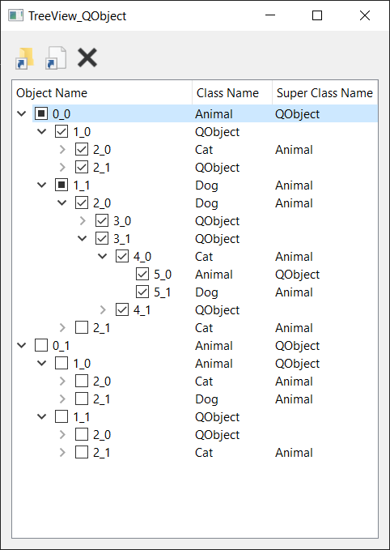

# TreeView_QObject
An experiment with CMake, QAbstractItemModel and QTreeView

## Features

* CMake 
    * Static or Shared Library
    * Executable
* Tree hierarchy is built on QObject's parent-children hierarchy
* Single Row Selection
* Add new item as top level
* Add new item as child
* Delete existing item (with its children)
* Checkable items (Tristate)
    * Auto-update children
    * Auto-update parents

## Screenshot

